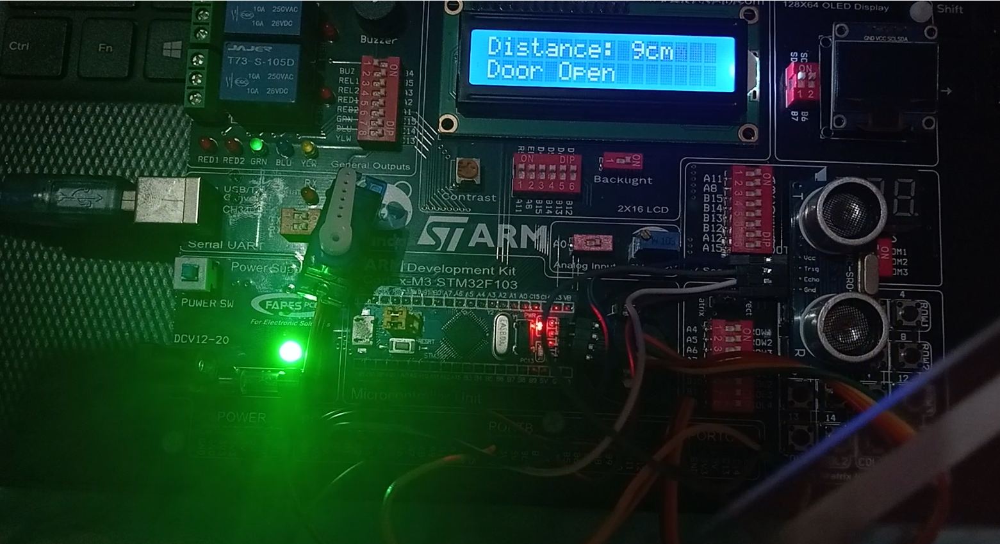

# 🚪 Smart Automatic Gate

A fully embedded **smart automatic gate system** built using the **STM32F103C8T6** microcontroller.  
The system detects objects (people) in front of a gate using an **HC-SR04 ultrasonic sensor** and automatically controls a **servo motor** to open/close the door.  
A **16×2 LCD** is used to monitor real-time distance and door status.

This project demonstrates the use of **PWM**, **Input Capture**, and **Timer-based delays** in STM32 microcontrollers.

---

## 📸 Project Overview

**Features included:**
- Automatic detection of obstacles using ultrasonic distance measurement  
- Smooth servo movement (open/close) controlled by PWM  
- Real-time status display on LCD  
- Accurate timing using hardware timers (PWM + Input Capture + µs/ms delays)

---

## 🛠 Hardware Used
- **STM32F103C8T6 (“Blue Pill”)**
- **HC-SR04 Ultrasonic Sensor**
- **SG90 Servo Motor**
- **16×2 Character LCD (4-bit mode)**

---
## 🧰 Software & Tools
- **STM32CubeIDE** – for coding, compiling, and debugging  
- **Programming Language:** C  
- **Embedded Layers:**
  - **MCAL:** GPIO, RCC, Timer (PWM & Input Capture),  
  - **HAL:** LCD, Ultrasonic, and Servo Motor  
  - **APP:** System initialization and operation logic  

---

## 🎬 Demo Video
Here’s a short demo showing the system in action:  

🎥 [Watch the demo on YouTube](https://youtu.be/bgwlse_9-qA)

---

## 🖼️ Take a Quick look 

<p align="center">
  
</p>
---

## 🧩 System Architecture
```plaintext
Project Root
│
├── main.c 
│
├── MCAL
│   ├── GPIO
│   ├── RCC
│   └── Timer (PWM & Input Capture Modes)
│
├── HAL
│   ├── LCD
│   ├── Ultrasonic Sensor
│   └── Servo Motor
│
└── Application
    ├── App.c
    └── App.h

---
## 🚀 How to Use

1. **Connect LCD with STM32**
   - D7 : B12
   - D6 : B13
   - D5 : B14
   - D4 : B15
   - EN : A8
   - RS : A11
2. **Connect Servo with STM32**
   - PWM : A7
3. **Connect Ultrasonic with STM32**
   - Trig : C15
   - Echo : A0
4. **Flash the STM32** code using STM32CubeIDE or ST-Link Utility (where the .elf & .bin & .hex files are available on Debug folder).    
---
